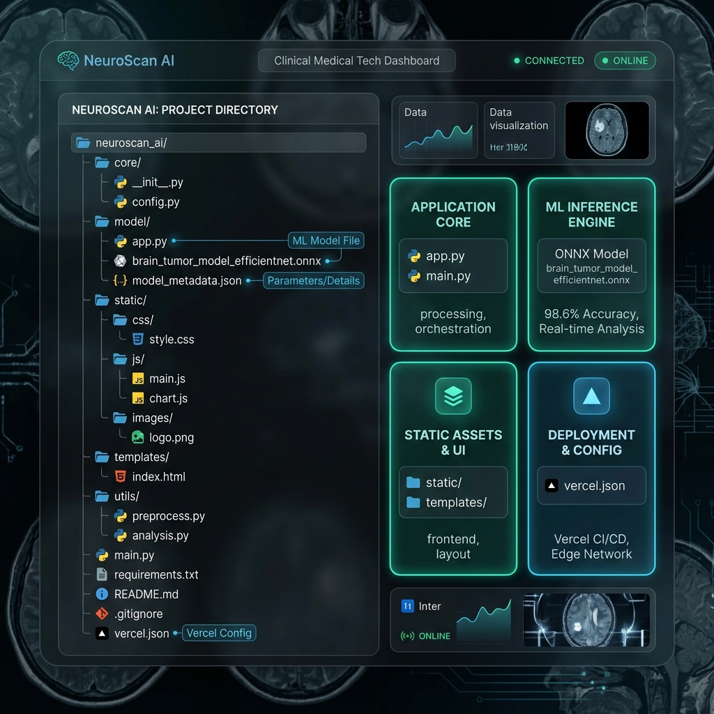

# 🧠 NeuroScan AI — Brain Tumor Detection System

NeuroScan AI is a professional, mobile-responsive Flask web application designed for classifying brain MRI scans into four distinct categories:
- **Glioma Tumor**
- **Meningioma Tumor**
- **No Tumor Detected**
- **Pituitary Tumor**

The application leverages a deep learning model based on the **EfficientNetB0** architecture, specifically trained using **Transfer Learning** for clinical image classification, achieving a test accuracy of **94.05%**.

---

## 🚀 Key Features

* **Optimized Local Inference:** Executes local model inference using **ONNX Runtime** (`onnxruntime`). This removes the need for a heavy TensorFlow dependency in the production runtime, resulting in lower memory usage, faster response times, and smaller deployment size.
* **Advanced Medical Validation:** Integrated image guardrails check structural features (grayscale channels, dark border, central brain contrast, and tissue structure checks) to prevent non-MRI or color images from being processed.
* **Interactive Workbench UI:** A premium, modern interface featuring a dark clinical theme, subtle micro-animations, upload progress tracking, and interactive diagnostic results.
* **Glassmorphic Lightbox Modal:** View model training history, confusion matrices, and Grad-CAM activation maps in a highly polished, responsive lightbox.
* **Vercel Serverless Compatibility:** Optimized to run seamlessly on Vercel serverless environments with a small runtime memory footprint and safe `/tmp` directory handling.
* **Fully Responsive:** Layouts adapt dynamically from widescreen desktops to mobile devices.

---

## 🧠 Model Architecture & Training Techniques

NeuroScan AI uses a state-of-the-art Convolutional Neural Network (CNN) engineered for optimal accuracy and training efficiency.


### 1. Model Backbone
- **Architecture:** `EfficientNetB0`
- **Pre-trained Weights:** ImageNet (locally cached)
- **Trainable Status:** Frozen (`backbone.trainable = False`) to preserve rich visual features and expedite training on CPU/GPU.

### 2. Custom Classification Head
To map extracted features to the brain tumor categories, a custom head was appended and trained:
- **Global Pooling:** Global Average Pooling yields a 1280-dimensional feature vector.
- **Regularization:** A `Dropout(0.25)` layer prevents overfitting on training data.
- **Classifier:** A `Dense(4, activation='softmax')` layer produces final class probability spreads.

### 3. Hyperparameters & Optimization
- **Optimizer:** `Adam` optimizer with a learning rate of `1e-3` for fast, stable convergence.
- **Loss Function:** `Sparse Categorical Crossentropy` suited for integer-mapped classification labels.
- **Early Stopping:** Monitored validation accuracy with a patience window of 8 epochs, restoring the best model weights dynamically.
- **Evaluation Performance:** Tested on independent datasets, yielding a **94.05% test accuracy**.

### 4. ONNX Inference Optimization
To achieve lightning-fast response times and ultra-lightweight deployments:
- **Format:** The trained Keras (`.keras`) model was exported to ONNX (`.onnx`) format using the `tf2onnx` library.
- **Lightweight Runtime:** Switched from standard TensorFlow to `onnxruntime`, dropping the container/package size constraint significantly.
- **Pipeline Adjustments:** Cleaned up the input preprocessing pipeline to handle normalized `[0, 1]` floats in NHWC format, directly matching the ONNX input signature.

---

## 🛡️ Image Preprocessing & Clinical Guardrails

To prevent incorrect diagnostic signals, the Flask API evaluates every uploaded scan through four automated validation steps before running inference:

| Guardrail Check | Algorithm Metric / Threshold | Rationale |
| :--- | :--- | :--- |
| **Grayscale Check** | Mean color difference between channels < 12.0 | Filters out color photographs and non-medical images. |
| **Dark Border Check** | Average outer 10% border brightness < 45.0 (0-255 range) | Ensures the image contains the dark background typical of MRI scans. |
| **Central Contrast Check** | Average center 50% brightness > 15.0 | Ensures the scan is not blank or pitch black. |
| **Brain Structure Check** | Center brightness > Border brightness + 5.0 | Confirms the presence of a brighter central tissue structure. |

---

## 📁 Project Structure

Below is the visual overview and clean tree layout of the application's workspace:



```text
├── app.py                            # Flask application server, API, and validation logic (configured for ONNX Runtime)
├── brain_tumor_model_efficientnet.onnx  # Optimized ONNX model used for local production inference
├── model_metadata.json               # Model metrics (accuracy, epochs, backbone metadata)
├── requirements.txt                  # Python application dependencies (Flask, ONNX Runtime, etc.)
├── .python-version                   # Specifies Python runtime version (3.11)
├── vercel.json                       # Vercel deployment routing and configuration
├── .vercelignore                     # Excludes unnecessary files from Vercel bundle
├── static/
│   ├── index.html                    # Workbench HTML structure & modal layout
│   ├── style.css                     # Main stylesheet with mobile responsive grids
│   ├── script.js                     # File upload, AJAX API client, and DOM interactions
│   └── images/                       # Model evaluation artifacts & visualizations
│       ├── confusion_matrix.png      # Matrix of true vs. predicted model outputs
│       ├── training_history.png      # Training/Validation accuracy and loss curves
│       └── gradcam_brain_tumor.png   # Model activation overlays indicating focus areas
│       ├── samples/                  # Representative static MRI sample images for each class
│       └── project_structure_viz.png # Visual diagram of the project structure
└── uploads/                          # Temporary workspace directory for file uploads (local only)
```

---

## 🛠️ Installation & Setup

### Prerequisites
- Python 3.11 (highly recommended; matches Vercel target runtime)
- No TensorFlow installation is needed to run the web application (handled via `onnxruntime`)

### Step 1: Clone and Install Dependencies
Install the lightweight application dependencies:
```bash
pip install -r requirements.txt
```

### Step 2: Start the Web Server
Launch the application locally:
```bash
python app.py
```
The console will confirm that the model loaded successfully using ONNX Runtime and display the local development server URL:
```text
============================================================
Brain Tumor Detection - Web Application
============================================================

Starting server...
Upload folder: C:\Users\...\uploads
Model loaded: Yes
Debug mode: Off

Open your browser and go to: http://localhost:5000
============================================================
```

---

## 🌐 Serverless Deployment (Vercel)

This application is ready for serverless deployment on **Vercel**:
* **Runtime Optimization:** Runs under Python 3.11 using CPU-optimized `onnxruntime` execution provider, avoiding large binary limits.
* **Temporary Filesystem:** Write operations during image uploads dynamically target `/tmp/uploads` since the main container directory is read-only.
* **Asset Exclusions:** Bulky files are excluded via `.vercelignore` to keep lambda sizes optimal.

---

## ⚠️ Clinical Disclaimer

> [!WARNING]
> This system is designed solely as an **educational prototype and research signal**. The predictions generated by the EfficientNetB0 model should not be used as professional medical advice, clinical diagnosis, treatment planning, or to make patient-care decisions. All diagnosis must be performed by qualified healthcare professionals using official, certified medical diagnostics.

